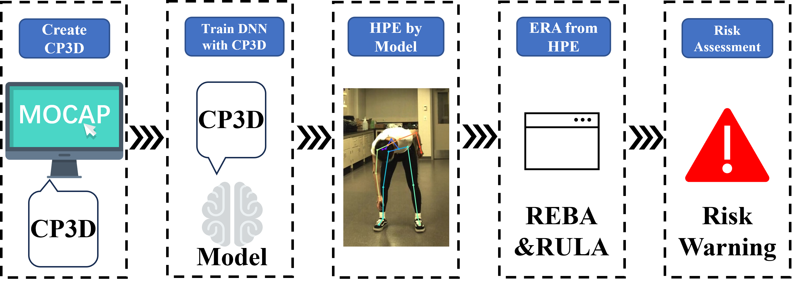
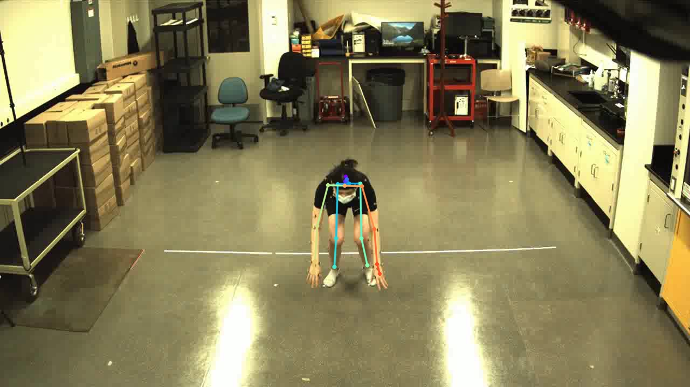

# CP3D
Construction Pose 3D(CP3D) is a publically available dataset specifically designed for 3D construction worker pose estimation. It includes around 0.5 million annotated 3D samples for 14 common construction activities. There are 7 human subjects/actors in the dataset. The dataset was captured with a Vicon motion capture system in a lab setting. The dataset and code will be made public once the paper is published. Please email xinming1@ualberta.ca to ask for the link to download the dataset and codes.


CP3D & CVRE of "3D pose estimation dataset and deep learning-based ergonomic risk assessment in construction"

<p align="center">

</p>

<p align="middle">
 
</p>

## Introduction

This repo is official **[PyTorch](https://pytorch.org)** implementation of **[3D pose estimation dataset and deep learning-based ergonomic risk assessment in construction.](https://doi.org/10.1016/j.autcon.2024.105452)**.

## Dependencies
* [PyTorch](https://pytorch.org)
* [CUDA](https://developer.nvidia.com/cuda-downloads)
* [cuDNN](https://developer.nvidia.com/cudnn)
* [Anaconda](https://www.anaconda.com/download/)
* [COCO API](https://github.com/cocodataset/cocoapi)

This code is tested under Ubuntu 22.04, CUDA 11.6, cuDNN 7.1 environment with two NVIDIA A5000 GPUs.

Python 3.9 version with Anaconda 3 is used for development.

## Quick demo
You can try quick demo at `demo` folder. 
* Download the pre-trained PoseNet in [here](https://).
* Prepare `input.jpg` and pre-trained snapshot at `demo` folder.
* Set `bbox_list` at [here]().
* Set `root_depth_list` at [here]().
* Run `python reba_estimation.py --gpu 0 --test_epoch 24` if you want to run on gpu 0.
* You can see `output_pose_2d.jpg` and new window that shows 3D pose.

## Directory

### Root
The `${ROOT}` is described as below.
```
${ROOT}
|-- data
|-- demo
|-- common
|-- main
|-- tool
|-- vis
`-- output
```
* `data` contains data loading codes and soft links to images and annotations directories.
* `demo` contains demo codes.
* `common` contains kernel codes for 3d multi-person pose estimation system.
* `main` contains high-level codes for training or testing the network.
* `tool` contains data pre-processing codes. You don't have to run this code. I provide pre-processed data below.
* `vis` contains scripts for 3d visualization.
* `output` contains log, trained models, visualized outputs, and test result.

### Data
You need to follow directory structure of the `data` as below.
```
${POSE_ROOT}
|-- data
|   |-- CP3D
|   |   |-- bbox_root
|   |   |   |-- .json
|   |   |-- images
|   |   |-- annotations
|   |-- MPII
|   |   |-- images
|   |   |-- annotations
|   |-- MSCOCO
|   |   |-- bbox_root
|   |   |   |-- bbox_root_coco_output.json
|   |   |-- images
|   |   |   |-- train2017
|   |   |   |-- val2017
|   |   |-- annotations
|   |-- MuCo
|   |   |-- data
|   |   |   |-- augmented_set
|   |   |   |-- unaugmented_set
|   |   |   |-- MuCo-3DHP.json
```
* Download MuCo parsed and composited data [[data](https://drive.google.com/drive/folders/
* All annotation files follow [MS COCO format](http://cocodataset.org/#format-data).
* If you want to add your own dataset, you have to convert it to [MS COCO format](http://cocodataset.org/#format-data).

### Output
You need to follow the directory structure of the `output` folder as below.
```
${POSE_ROOT}
|-- output
|-- |-- log
|-- |-- model_dump
|-- |-- result
`-- |-- vis
```
* Creating `output` folder as soft link form is recommended instead of folder form because it would take large storage capacity.
* `log` folder contains training log file.
* `model_dump` folder contains saved checkpoints for each epoch.
* `result` folder contains final estimation files generated in the testing stage.
* `vis` folder contains visualized results.

## Reference
```
@article{FAN2024105452,
title = {3D pose estimation dataset and deep learning-based ergonomic risk assessment in construction},
journal = {Automation in Construction},
volume = {164},
pages = {105452},
year = {2024},
issn = {0926-5805},
doi = {https://doi.org/10.1016/j.autcon.2024.105452},
url = {https://www.sciencedirect.com/science/article/pii/S0926580524001882},
author = {Chao Fan and Qipei Mei and Xinming Li},
keywords = {3D human pose estimation, Motion capture data, Computer vision, Construction safety, Ergonomic risk assessment, REBA, RULA}
}
```
